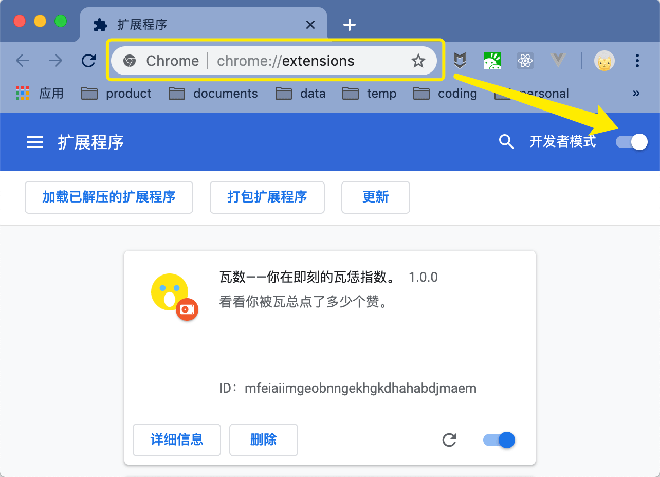

# Jike Wow Index Extension

使用截图：

## 功能简介

[即刻](https://okjike.com/)是一个有意思的 App，而[我](https://web.okjike.com/user/d1463ce6-2b40-4537-87fe-e50c02a3e9b9/post)是一个无聊的人。这是我基于即刻 Web 版做的一个插件，它的作用只有一个——计算你的“瓦数”。所谓“瓦数”，就是你在即刻上的动态或评论被即刻 CEO 瓦总点赞的次数。一个人的“瓦数”越高，说明……什么也说明不了。

## 安装使用说明
你需要先下载这个 [crx 文件](https://github.com/leadream/wowIndex/releases/download/v1.0.0/wowIndex.crx)，接着打开 Chrome 浏览器，在地址栏输入 `chrome://extensions/`。在右上角打开开发者模式，将文件拖拽进来，完成安装。

此时你的浏览器地址栏右侧就出现了一个插件图标，点它就会弹出“瓦数”计算页面。

点击开始计算按钮就开始计算了，这需要一会时间，取决于你发送的状态或评论数量，你在即刻越活跃需要的时间越久。

计算结束，就可以看到你的“瓦数”了。

## 参考项目
感谢下面两个项目，给了我很多灵感。
- [coder-ysj/jike-meow](https://github.com/Doila/love-jike-chrome-extension)
- [Doila/love-jike-chrome-extension](https://github.com/coder-ysj/jike-meow)
